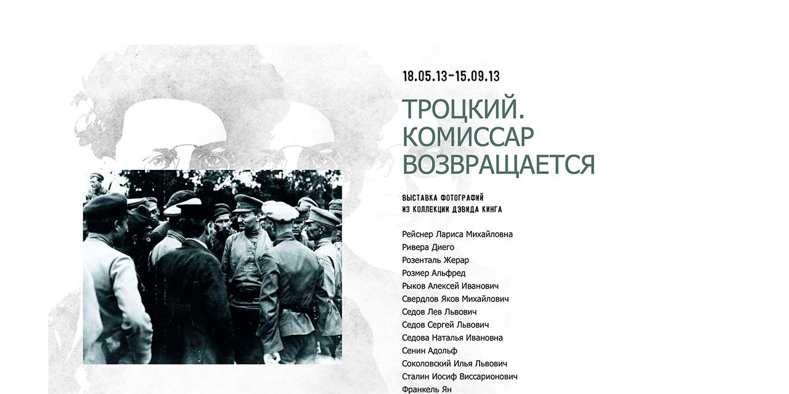

# Троцкий. Комиссар возвращается

*Trotsky. The Commissar Returns*

Сайт выставки о Льве Троцком: более 170 фотографий из коллекции Дэвида Кинга, продолжение проекта «Комиссар исчезает».

**[Открыть архив →](https://commissarreturns.gmig.gulagmemory.org)** · [Все сохранённые сайты](https://gulagmemory.org)

| | |
|:--|:--|
| **Тип** | Сайт выставки |
| **Годы** | 2013 |
| **Исходный адрес** | `commissarreturns.ru` |
| **Адрес архива** | [commissarreturns.gmig.gulagmemory.org](https://commissarreturns.gmig.gulagmemory.org) |
| **Снимок сделан** | февраль 2026 · `wget` |

## О проекте

Выставка работала в Музее истории ГУЛАГа на Петровке, 16, с 18 мая по 15 сентября 2013 года. Она продолжала проект «[Комиссар исчезает](https://github.com/gulag-museum/comissarvanishes.ru)»: если первая выставка показывала, как опальных деятелей вычищали из советских фотографий, то эта возвращала в визуальную историю главного из них — Троцкого, стёртого из официальных изображений на десятилетия.

В основе — коллекция Дэвида Кинга, который с 1970 года собирал всё, что мог найти о Троцком, после того как в советских музеях революции не нашлось ни одной его фотографии.

## Что сохранено

- текст о выставке и эссе Дэвида Кинга;
- биография Льва Троцкого;
- галерея фотографий и указатель людей, изображённых на снимках;
- русская и английская версии сайта.

---

Репозиторий входит в [реестр сохранённых сайтов Музея истории ГУЛАГа](https://gulagmemory.org) — некоммерческий архив цифрового наследия, созданный в исследовательских и образовательных целях. Права на тексты, фотографии, видео и другие материалы принадлежат их авторам и правообладателям.

<b>English</b>

### Trotsky. The Commissar Returns

Website of the 2013 exhibition on Leon Trotsky at the GULAG History Museum: over 170 photographs from David King's collection, a sequel to The Commissar Vanishes. Includes King's essay, a Trotsky biography, a gallery and an index of people. Russian and English.

**Type:** Exhibition website · **Original address:** `commissarreturns.ru` · **Archive:** [commissarreturns.gmig.gulagmemory.org](https://commissarreturns.gmig.gulagmemory.org)

Part of the [registry of preserved GULAG History Museum websites](https://gulagmemory.org) — a non-commercial digital heritage archive for research and education. All texts, photographs, video and other materials remain the property of their authors and rights holders.

